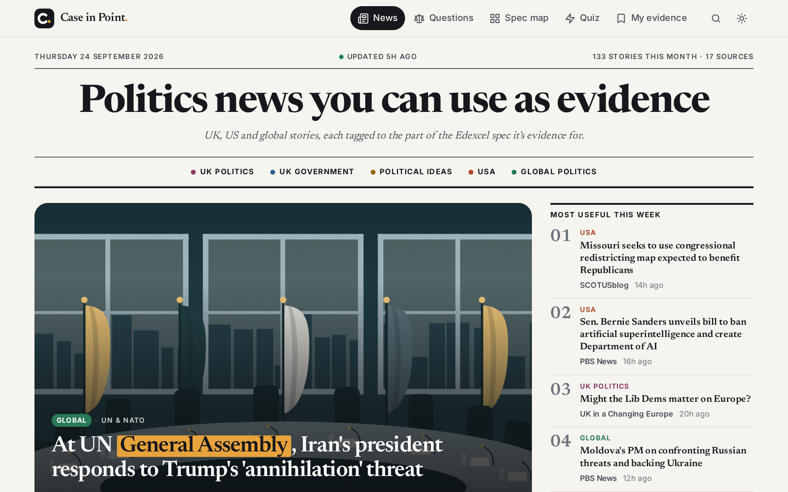

# Case in Point

**Politics news you can use as evidence**, mapped to the Pearson Edexcel A level Politics spec (9PL0).



Case in Point checks 29 politics sources every three hours: BBC, the Guardian, Sky, the Telegraph, the House of Commons and Lords Libraries, GOV.UK, NPR, PBS, SCOTUSblog, UN News, Al Jazeera, Carbon Brief and more. It tags each story to the part of the spec it's evidence for, then gives students tools to use it:

- **Front page**: a newspaper-style front page with today's lead story, a numbered *Most useful this week* list, a *Number to know* fact, a practice question and a section for each paper. Stories show the publisher's photo: from the feed, or else the one the article page shows when its link is shared. Stories with no photo get one of the site's own drawings that fits the topic (Parliament, the White House, a ballot box, a globe and so on).
- **All the latest**: every story as a card, with the exam question it could help with. Filter by paper, spec point or source type, or search.
- **Exam question matcher**: 52 exam-style questions. Recent stories are sorted into the arguments for and against each one, and there's a one-click essay plan.
- **Spec coverage map**: every spec point, with how much recent evidence exists for it.
- **Quick-fire quiz**: *Spec Sort* (which spec point does this headline fit?) and key-facts flashcards.
- **My evidence**: save stories, add your own notes, and export them as notes or a backup.
- It works on phones, can be installed as an app, has a dark mode and needs no accounts. Everything personal stays in the reader's browser.

It's a static website. GitHub Actions does the updating for free, so there's no server or database to run.

---

## Put it online (about 10 minutes)

You need a free GitHub account.

1. **Create a repository.** On github.com click **New repository**, name it (for example `case-in-point`), choose **Public** and click **Create**. GitHub Pages is free for public repositories.
2. **Upload the files.** Pick one of these:
   - **GitHub Desktop:** *File → Add local repository*, choose the unzipped folder, then **Publish repository**.
   - **Terminal:**
     ```bash
     cd case-in-point
     git init -b main
     git add .
     git commit -m "Case in Point"
     git remote add origin https://github.com/YOUR-USERNAME/case-in-point.git
     git push -u origin main
     ```
   - **Web upload** (*Add file → Upload files*) works too. However, macOS hides the `.github` folder that contains the updater. After uploading, use *Add file → Create new file*, name it `.github/workflows/update.yml`, and paste in that file's contents.
3. **Turn on GitHub Pages.** Go to *Settings → Pages → Build and deployment → Source* and choose **GitHub Actions**.
4. **Run the updater.** On the **Actions** tab, open **Update news and deploy** and click **Run workflow**. If GitHub asks, enable workflows first. The first run takes 1–2 minutes.
5. **Open your site** at `https://YOUR-USERNAME.github.io/case-in-point/` (the link is also shown under *Settings → Pages*).

After that, the site updates itself every 3 hours. The first update of the day is live before 6:00 am Dubai time.

**Hosting on Netlify as well (optional).** Connect the repository in Netlify and it follows `netlify.toml`: it builds the site from `main` and loads the news straight from the `data` branch, so it stays as up to date as the GitHub Pages site without rebuilding. If you copied this project, change the repository name in `netlify.toml`.

## How it works

Every 3 hours, `.github/workflows/update.yml` does four things:

1. It restores the news archive from the `data` branch.
2. `scripts/update-news.mjs` fetches every feed in `config/feeds.json`, then:
   - cleans each story;
   - tags it with spec points using the rules in `config/spec.json`;
   - merges near-identical headlines from different outlets into one story;
   - for stories whose feed has no photo, reads the top of the article page for its share photo (it follows each site's robots.txt, asks each site for one page at a time and skips logos);
   - keeps a rolling archive of up to 24 months.
3. It saves the archive back to the `data` branch. It overwrites a single commit each time, so the repository stays small.
4. It publishes the site to GitHub Pages.

The website itself (`index.html` and `assets/`) is plain HTML, CSS and JavaScript, with no build step.

If one source is down, the others still update. The **About** page shows each source's status. If every source fails, the workflow stops and the site keeps its previous news.

## Run it on your computer

You need [Node.js](https://nodejs.org) 20 or newer.

```bash
npm install
npm run update     # fetch the latest news into ./data
npm run dev        # then open http://localhost:8080
npm test           # check the feed parser and tagging rules
```

No internet? `npm run update:fixtures` builds demo data from saved sample feeds.

## Customise it

| What | Where |
|---|---|
| Name, title, logo | `index.html`, `manifest.webmanifest`, `assets/icons/` |
| Colours and fonts | the variables at the top of `assets/css/styles.css` |
| Photos on or off | `"images"` at the top of `config/feeds.json` (`"pagePhotos"` for photos from article pages) |
| The drawings | `assets/art/scenes.svg`; which drawing each spec topic gets is in `assets/js/art.js` |
| News sources | `config/feeds.json` |
| Tagging rules | `config/spec.json` |
| Exam questions | `config/questions.json` |
| Quiz facts | `config/facts.json` |
| How often it updates | the `cron` lines in `.github/workflows/update.yml` (times are UTC; Dubai is UTC+4) |

**Adding or removing news sources.** Each line in `config/feeds.json` is one RSS or Atom feed with these fields:

- `region`: `uk`, `us` or `intl`. This helps the tagger.
- `kind`: `news`, `analysis`, `explainer` or `official`.
- `politicsOnly`: keep stories even when no spec point matches.
- `weight`: how highly the source ranks.
- `enabled: false`: switch the feed off.
- `images: false`: don't show this feed's photos. `pagePhotos: false`: don't look for photos on this feed's article pages. `imageFromContent: true` also uses the first picture in the article text (NPR needs this; for most blogs it would pick up charts).

**Improving the tagging.** Each spec point in `config/spec.json` has keywords with weights: 3 is strong, 2 medium, 1 weak. A story gets the tag when its score reaches 3, and matches in the headline count 1.5 times. The keyword syntax is:

- `select committee`: whole words, any case.
- `rebel*`: any ending (rebel, rebels, rebellion).
- `cs:Greens`: case-sensitive.
- `re:…`: a regular expression.

New names come up all the time (a new minister, a new court case), so add them as they appear. Run `npm test` afterwards.

**Adding exam questions.** Each question in `config/questions.json` has spec tags, two sides and a set of *strands* (arguments). Every strand has an example hint and keywords that decide which stories appear under it.

## Optional: AI study notes

If you add an Anthropic API key, each run also writes short study notes for up to 8 new stories:

- a plain-English summary;
- suggested exam angles (which side of which question the story supports);
- a couple of quiz flashcards.

These appear on the site with an **AI notes** badge. To set it up:

1. Create a key at [console.anthropic.com](https://console.anthropic.com). You'll need to add some credit.
2. In your repository, go to *Settings → Secrets and variables → Actions → New repository secret*. Name it `ANTHROPIC_API_KEY` and paste the key.
3. Optionally, on the **Variables** tab of the same page, set:
   - `AI_MAX_PER_RUN`: how many stories get notes each run (default 8).
   - `AI_MODEL`: which model writes them (default `claude-haiku-4-5-20251001`).

Rough cost: about $0.25 per 100 stories with the default model, which is typically a few dollars a month. The notes are written from each story's headline and blurb only, and the site reminds readers to check the original article.

## Use your own domain

For example `politics.laworchard.com`:

1. Go to *Settings → Pages → Custom domain* and enter the domain.
2. At your domain provider, add a `CNAME` record that points to `YOUR-USERNAME.github.io`.

## Troubleshooting

- **The site says "No news has been fetched yet".** The workflow hasn't finished successfully yet. Check the Actions tab and run it again.
- **The "Deploy to GitHub Pages" step fails.** Under *Settings → Pages*, the Source must be set to **GitHub Actions**.
- **The "Save the archive" step fails.** Go to *Settings → Actions → General → Workflow permissions* and choose **Read and write permissions**.
- **The About page says a source is "Not reachable".** That site may be blocking automated requests, or it may have moved its feed. Update the feed's address or switch it off in `config/feeds.json`.
- **Scheduled runs have stopped.** GitHub pauses scheduled workflows in repositories with no activity for 60 days. Re-enable the workflow on the Actions tab.
- **The site still looks old after you've made changes.** Do a hard refresh. The site works offline, so your browser may be showing a cached copy.

## Good to know

- **Copyright:** the site shows only headlines, the publishers' short descriptions and the photos their feeds and share previews supply, and always links to the original article. Photos load straight from the publisher's website (nothing is copied), and each one belongs to its publisher. To stop using photos from article pages, set `"pagePhotos": false`; to show no photos at all, set `"images": false` (both at the top of `config/feeds.json`). The drawings were made for this site.
- **Tags are automatic** and can be wrong. Each story shows which words it was matched on.
- **The practice questions** were written for this site; they aren't official Pearson questions.
- **Spec version:** topics follow Issue 3 of 9PL0 (A level exams up to 2027). Issue 4 (first A level exams in 2028) keeps the same topics with small changes.
- **Not affiliated** with Pearson Edexcel.
- **Privacy:** saved stories, notes and quiz progress stay in each reader's browser. Nothing is uploaded.

## Project structure

```
index.html, manifest.webmanifest, sw.js   website shell, app manifest, offline support
assets/css/styles.css                     all styles (light + dark)
assets/js/                                the app: app.js (router), store.js (data), art.js (drawings), views/…
assets/art/scenes.svg                     the site's drawings for stories without a photo
assets/js/lib/keywords.js                 keyword engine, shared by the website and the updater
config/                                   feeds, spec map + tagging rules, questions, quiz facts
scripts/update-news.mjs                   the news updater (lib/: fetch, parse, images, pagephoto, tag, cluster, AI)
scripts/build-site.mjs, scripts/serve.mjs build for GitHub Pages / local web server
netlify.toml                              settings for hosting on Netlify (news comes from the data branch)
scripts/test/                             tests and saved sample feeds
.github/workflows/update.yml              the 3-hourly update + deploy
```
